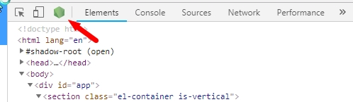

# 终于可以学习的nodejs

## 学习资源
<https://github.com/nswbmw/N-blog>

## 工具技巧

#### 1. 如何查看nodejs是否支持某个特性
- 通过<https://node.green/>查看
- 通过es-checker来检测[感觉并不太准确，node 10.3 ,居然检测出不支持]

#### 2. nodejs 如何调试：

```shell
# 安装nodemon，全局或者本地安装
npm i nodemon --save-dev
# 启动inspect
nodemon --inspect server/index.js
```

打开chrome 控制台，点击node的调试控制台：



>本地安装nodemon时，建议将启动脚本写入package.json

```shell
# package.json
# 运行npm run debug即可
"scripts": {
    "debug": "cross-env NODE_ENV=development nodemon --inspect server/index.js",
},
```

#### 3. __dirname, __filename, process.cwd()，./,../到底什么关系

- `__dirname`:总是返回被执行的 js 所在文件夹的绝对路径
- `__filename`: 总是返回被执行的 js 的绝对路径
- `process.cwd()`:总是返回运行 node 命令时所在的文件夹的绝对路径,相当于运行`pwd`命令
- `./`:这个相对路径到底相对于谁，使用时要分情况（`../`的处理方式也一样）
    + 在`a.js`中 使用`requrire('./xxx/yyy.js')`,此时是正常理解的引用相对于`a.js`,的`yyy.js`文件。
    + 其他情况，比如在`a.js`中，`fs.readFile('./xxx/yyy.js')`,此时是相对于`process.cwd()`来引入的，而不是相对于`a.js`
    + 因此，require的方式可以使用相对路径，其他情况,都需要把相对路径path.resolve转换成绝对路径才能正确处理路径情况。

>一句话总结就是：

>When using require, the path is relative to that source file (NOT root directory).

>When using fs, the path is relative to process.cwd() (NOT that source file).

## 待搞明白的事情
1. nodejs 的版本问题，稳定版和LTS是什么关系？
2. node 的rpc是什么东西？
3. koa-session
4. ioredis
5. pm2 开机启动
6. 搭建私有npm
7. Joi进行输入输出验证： koa-context-validator
8. koa-i18n
9. https://github.com/nodejs/Release#release-schedule

## 文章

[浅析 NodeJs 的几种文件路径](https://github.com/imsobear/blog/issues/48)
