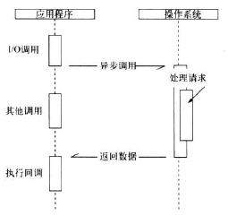
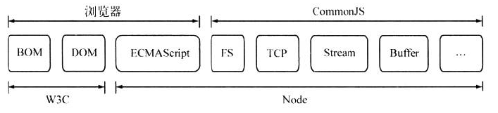
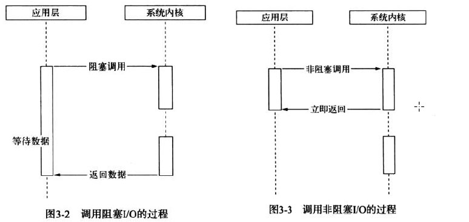
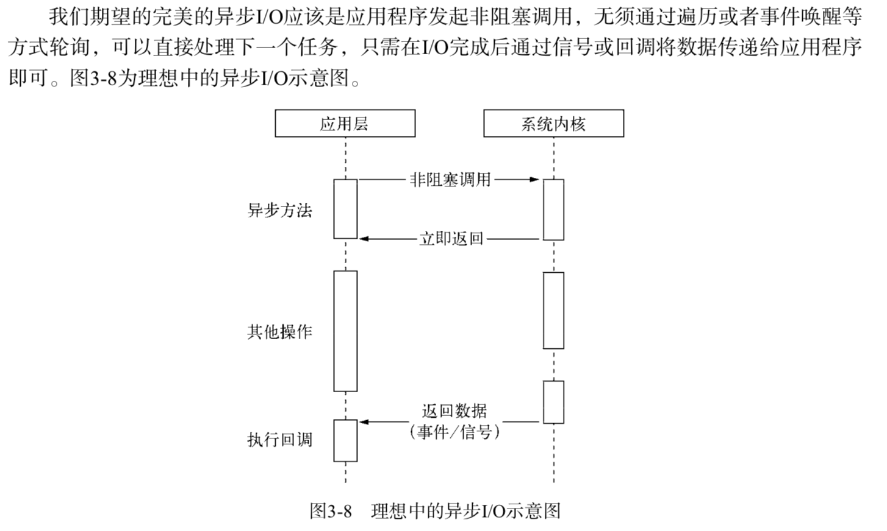
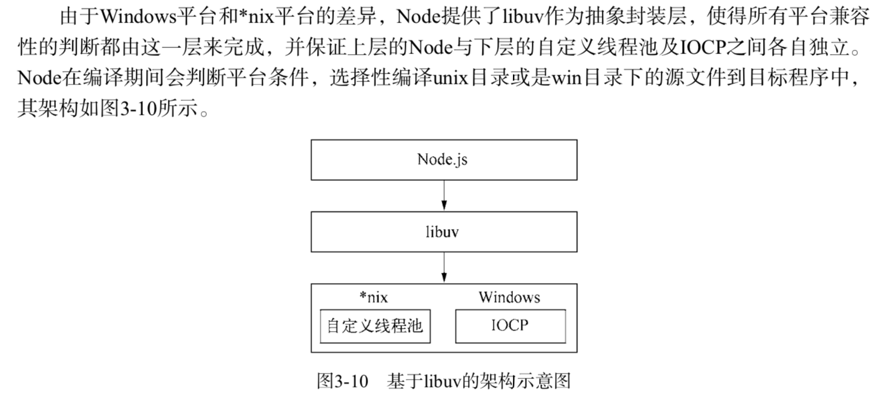
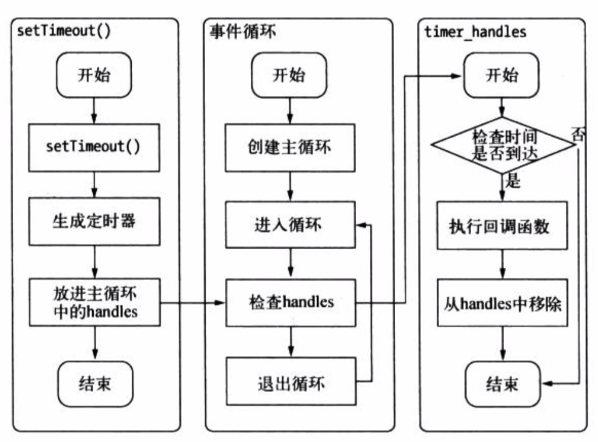
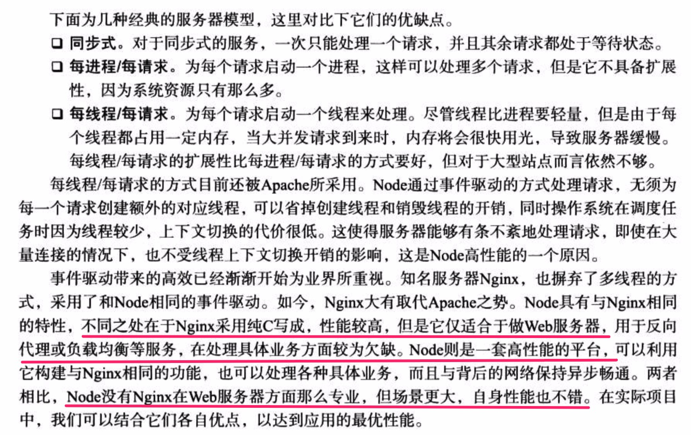

				当前进度：3.2


## 第一章 Node简介

##### 1. 单线程与多线程

**Node 保持了JavaScript浏览器中单线程的特点。单线程最大的好处是不用像多行程那样处处在意状态的同步问题，没有死锁的存在。**


单线程同时存在这些问题：

- 无法利用多核CPU
- 错误会引起整个引用退出，引用的健壮性值得考验
- 大量计算占用CPU导致无继续调用异步I/O。


Node通过子进程 child_process的方式解决单线程中计算量大的问题。

##### 2. Node 的特点

- 异步IO
    + node 在低层构建了很多异步IO 的API，从文件读取都网络请求均是如此
    + 对于同步IO而言，他们的耗时是两个任务的耗时之和SUM（M，N），而异步IO，其耗时是MAX（M,N）
    + 异步IO的提出是期望IO的调用不再阻塞后续运算（CPU的调用），将原有等待IO的时间分配给其他需要（CPU）的业务去执行
- 基于事件的回调
    + node引入前端的事件机制，配置异步IO，将事件点暴露给业务逻辑。事件的编程方式具有轻量级、松沟壑、只关注事件点执行具体事务等优势。而回调也是最好的接受异步调用返回数据的方式。
- 单线程

异步IO调用示意图




## 第二章 Node的模块实现

##### 1. 模块标识

- 模块标识就是传递给require()方法的参数，它必须是符合小驼峰命名的字符串，或者以. / ..开头的相对路径，或者是绝对路径。

- require在分析标识符时，对于标识符不包含扩展名的情况，Node会一次按.js,.node,.json次序补足扩展名。因此，对于.node,.json文件，带上扩展名，会加快文件定位的速度。

小驼峰命名：
第一个单词首字母小写，后面其他单词首字母大写，如 className, baseUtil


##### 2. Node的模块

Node的模块分为2类：

```html
- 核心模块：Node直接提供的模块，在Node源代码的编译过程中，已经编写成了二进制可执行文件， 在Node进程启动时，部分核心模块被直接加载在内容，其加载速度最快。如：fs，http，path
- 文件模块：文件模块在运行时动态加载，需要完整的【路径分析，文件定位，编译执行】过程，速度比核心模块慢。
```


#####  3. Node目录分析和包

文件定位的顺序： 缓存加载 > 核心模块 > 路径形式的文件模块 > 自定义模块（非核心模块，非路径形式的标识符）

 require()通过分析文件扩展名之后，可能没有找对对应的文件，此时，会将该文件名当做一个目录名称，并当做一个包处理。

 1. 在当前目录中查找package.json文件，JSON.parse解析包描述对象，取main属性对应的文件进行定位
 2. 如果没有package.json 文件或者文件内容出错，则node会将index作为默认文件名，并按照index.js,index.node,index.json的次序查找。
 3. 如果在目录分析的过程中没有成功定位任何文件，则进入下一个模块路径（上一级目录）进行查找。
 4. 如果模块路径都遍历完成，都未定位，则报错。


##### 4. Node,W3c,Commonjs ECMAScript之间的关系



##  第三章 异步IO

我们时长提到node是单线程的，这里的单线程仅仅只是JavaScript执行在单线程中罢了。在node中，无论是*nix还是Windows品台，内部完成IO任务的另有线程池。

#### 阻塞与非阻塞：

操作系统内核对于IO只有2钟方式：阻塞和非阻塞

- 阻塞IO：
    - 应用程序在调用后，一定要等到系统内核层面完成所有操作，应用程序等待IO完成才返回结果。
    - 例如：读取磁盘上的一段文件，系统内核在完成磁盘寻道、读取数据、复制数据到内存之后，调用才结束
    - 问题：造成CPU待待IO、浪费等待时间，CPU的处理时间不能得到充分的利用。
- 非阻塞IO：
    - 应用程序在调用后，立即返回，非阻塞IO返回之后，CPU的时间片可以用来处理其他事物，此时的性能明显提升。
    - 问题：由于完成的IO并没有完成，立即返回的并不是业务期望的数据，而仅仅是当前调用的状态；为了获得完成的数据，应用程序会重复调用IO操作来确认是否完成；这一操作叫轮询。

> 操作系统对计算机做了抽象，将所有的输入输出设备抽象为文件。内核在进行文件IO的时候，通过文件描述符进行管理。应用程序进行IO调用时，先打开文件描述符，然后再根据文件描述符去实现文件数据的读写。
> 阻塞IO完成整个获取数据的过程，而非阻塞IO则不带数据直接返回，要获取数据，要通过文件描述符再次读取。



#### 理想的非阻塞异步IO



#### 现实的异步IO

windows 上通过IOCP的方式实现异步IO:调用异步方法，等待IO完成之后的通知，执行回调，用户无需考虑轮训。但是它内部仍然是线程池原理。

*nix通过自定义线程池的方式来实现异步IO。



#### Node 的异步IO

#### 非IO的异步API

##### setimeout的行为



##### setTimeout(fn,0) 和 process.nextTick的区别

- 一般情况下，settimeout(fn,0)能和process.nextTick达到同样所需的效果。
- 但是，由于事件循环自身的特特点，定时器的精确度不够，而事实上，定时器需要动用红黑树创建定时器对象和迭代等操作，而settimeout(fn,0)的方式较为浪费性能。
- process.nextTick更为轻量，每次调用process.nextTick方法，只会将回调函数放入队列中，在下一轮tick时取出执行。
- 定时器采用红黑树的操作时间复杂度是O(lg(n)),process.nextTick的时间复杂度是O(1),后者更加高效

####  setImmedinate 和process.nexttick的区别

- 在具体实现上， process.nextTick(的回调函数保存在一个数组中， setImmediate()的结果
则是保存在链表中。
- 在行为上， process.nextTick()在每轮循环中会将数组中的回调函数全部执
行完，而 setImmediate()在每轮循环中执行链表中的一个回调函数
- 事件轮训对观察者的检查是有先后顺序的，setTimeout采用的是类似IO观察者，setImmediate采用的是check观察者，而process.nextTick()采用的是idle观察者。
- 在每一个轮询检查中，三种观察者的优先级顺序是：idle观察者>io观察者>check观察者

这里有更清楚的解释：
https://juejin.im/post/5c3d8956e51d4511dc72c200
https://nodejs.org/zh-cn/docs/guides/event-loop-timers-and-nexttick/

#### 几种服务器类型


##  第十一章 产品化

####  11.3 性能

对于web应用而言，最直接有效的莫过于动静分离、多进程架构、分布式。其中涉及的几个拆分原则如下：

- 做专一的事
- 让擅长的工具做擅长的事情
- 将模型简化
- 将风险分离

除此之外，缓存也能带来极大的性能提升。

主要从这4个方面来处理。

-  动静分离
    +  node 尽管也能通过中间件实现静态文件服务，但是node处理静态文件的能力并不算突出。
    +  将图片、js、css和media资源引导到专业的静态文件服务器，让node只处理动态请求，如nginx，cdn。
-  启用缓存
    +  resis
    +  memcached
-  多进程架构
    + 由于node是通过自有模块构件http服务器，不像大多数服务器端技术那样有专门的文本容器（比如java有tomcat，php有nginx），所以需要开发者自己处理多进程的管理。
    + 工具有 pm2，cluster
-  读写分离
    + 就任意数据库而言，读取的速度远远高于写人的速度。而某些数据库在写入时为了保证数据一致性，会进行锁表操作，这同时会影响到读取的速度。某些系统为了提升性能，通常会进行数据库的读写分离，**将数据库进行主从设计**，这样**读数据操作不再受到写入的影响，降低了性能的影响**
